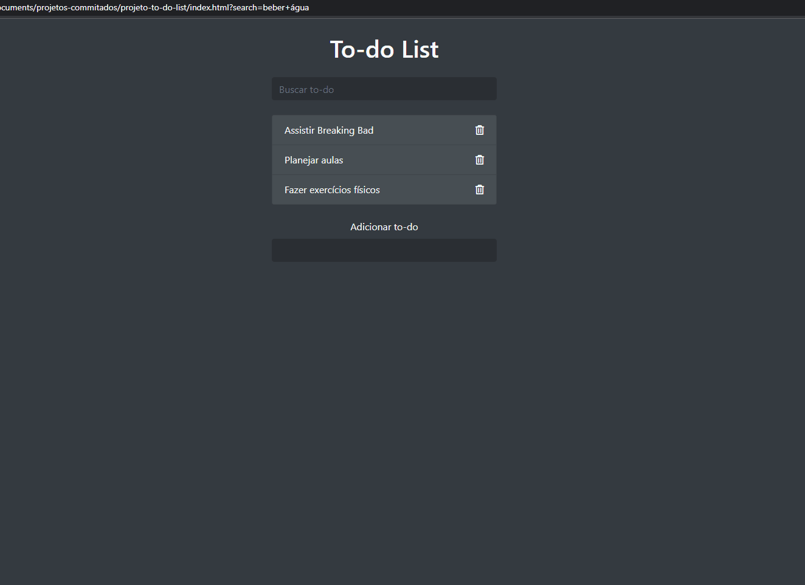

# Projeto To-do list com filtro de pesquisa 📝

Página To-do list com filtro de pesquisa.

Algumas funcionalidades: Adiciona tarefa(s), remove tarefa(s), pesquisa tarefa(s)
Ao digitar uma string no input de pesquisa, as tarefas que não correspondeerem, são retiradas da tela.

## Tecnologias

- Javascript
- Bootstrap
- CSS
- HTML

---

<h2 align="center">Viewport</h2>

 
___
